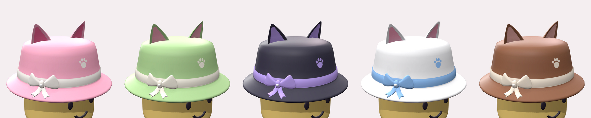

# 🐱🎀 Neko Bucket Hat : UGC Roblox (Hat)

Un **bob à oreilles de chat** avec un **nœud coquette** et sa perle, une petite **patte** imprimée devant, en **plastique simple** (aplats de couleur propres, sans fourrure ni bruit). Il existe en **5 coloris**.



| Fraise | Matcha | Minuit | Nuage | Choco |
|---|---|---|---|---|
| rose + nœud crème | vert sauge + crème | anthracite + lilas | blanc + bleu ciel | marron + crème |

Tendances visées : oreilles d'animaux, nœuds « coquette », couleurs pastel, formes généreuses et déclinaisons de couleurs (les items vendus en plusieurs couleurs se vendent mieux).

---

## 📦 Ce qu'il faut importer

```
ugc/neko-bucket-hat/
├── fbx/                      ← À IMPORTER DANS STUDIO (1 fichier = 1 couleur, texture incluse)
│   ├── NekoBucketHat_Fraise.fbx
│   ├── NekoBucketHat_Matcha.fbx
│   ├── NekoBucketHat_Minuit.fbx
│   ├── NekoBucketHat_Nuage.fbx
│   └── NekoBucketHat_Choco.fbx
├── textures/                 ← les PNG 1024×1024 (au cas où, voir dépannage)
├── obj/                      ← même maillage en .obj (secours)
└── previews/                 ← images de présentation
```

Chaque `.fbx` contient **le maillage + la texture intégrée**. Ils ont été exportés avec Blender 5.2 en suivant les réglages préconisés par la doc Roblox (*Path Mode = Copy*, *Embed Textures*, *Apply Scalings = FBX Unit Scale*, avant = Z, haut = Y), donc 1 unité = 1 stud et l'avant du chapeau regarde l'avant de l'avatar.

---

## 🚀 De Studio à la Marketplace en 6 étapes

### 1. Importer
1. Ouvre Roblox Studio (n'importe quel place, une Baseplate suffit).
2. **File › Import 3D** (ou bouton **Import 3D** de l'onglet Home), puis choisis par exemple `fbx/NekoBucketHat_Fraise.fbx`.
3. Dans la fenêtre d'aperçu, **ne change rien**. Les valeurs par défaut sont les bonnes :
   - *Scale Unit* : **Studs**
   - *World Forward* : **Front**, *World Up* : **Top**
   - *Upload to Roblox* : coché
   - Taille affichée : environ **1,74 × 0,99 × 1,74** studs, **3 820 triangles**
4. Clique **Import**. Un `Model` apparaît dans le Workspace avec le MeshPart `NekoBucketHat` déjà texturé.

### 2. Transformer en accessoire (Accessory Fitting Tool)
1. Onglet **Avatar › Accessory**.
2. **Part** : sélectionne le MeshPart `NekoBucketHat` dans l'Explorer, puis **Next**.
3. **Asset Type** : **Accessory › Hat**. Pour le type de corps (*body type*), prends **Classic** : le chapeau est calibré sur la tête R15 classique de 1,2 stud et rentre aussi dans les limites Normal et Slender. Puis **Next**.
4. Vérifie sur le mannequin que **la patte est devant** et que **le nœud est sur le côté avant droit**. Ajuste au besoin avec Move/Scale.
5. **Generate MeshPart Accessory**. Un `Accessory` est créé.

### 3. Vérifier (10 secondes)
1. Sélectionne l'`Accessory` dans l'Explorer.
2. **View › Command Bar**, colle tout le contenu de [`ugc/VerifierUGC.lua`](ugc/VerifierUGC.lua) (valable pour tous les accessoires) puis appuie sur Entrée.
3. Dans **Output**, tu dois lire `🎉 Prêt`. Le script corrige tout seul ce que Roblox exige (type Hat, matériau Plastic, transparence 0) et signale le reste.

### 4. Uploader
Clic droit sur l'`Accessory` › **Save to Roblox** › *Submit As* : **Avatar Asset** › *Asset type* : **Hat**. La validation Roblox se lance. Remplis titre et description (voir la fiche ci-dessous), puis **Submit**.

### 5. Modération
L'item part en modération. Tu le retrouves dans le [Creator Hub › Creations](https://create.roblox.com/dashboard/creations).

### 6. Mettre en vente
Dans **Manage Item** : prix, Limited ou non, puis **Publish**. Recommence les étapes 1 à 4 avec les autres `.fbx` pour sortir toute la gamme de couleurs.

> ⚠️ **Prérequis compte** : pour vendre sur la Marketplace, ton compte doit remplir les [conditions créateur de Roblox](https://create.roblox.com/docs/marketplace/marketplace-policy#creator-and-group-requirements), et des [frais d'upload et de publication](https://create.roblox.com/docs/marketplace/marketplace-fees-and-commissions) s'appliquent. Si tu ne vois pas le menu *Asset type* à l'étape 4, ton compte n'y a pas encore accès.

---

## 🏷️ Fiche Marketplace (à copier-coller)

**Titre (EN, recommandé pour la visibilité)**
```
Kawaii Cat Ear Bucket Hat w/ Bow - Pink
```
(remplace `Pink` par `Matcha`, `Midnight`, `Cloud` ou `Cocoa` selon la couleur)

**Description (EN)**
```
A cute bucket hat with cat ears, a coquette bow with a pearl and a little paw print. Clean, simple plastic style. Available in 5 colors: Pink, Matcha, Midnight, Cloud and Cocoa!
```

**Titre (FR)**
```
Bob Oreilles de Chat Kawaii + Nœud - Rose
```

**Description (FR)**
```
Un bob trop mignon avec oreilles de chat, nœud coquette à perle et petite patte. Style plastique simple et propre. Existe en 5 couleurs : Rose, Matcha, Minuit, Nuage et Choco !
```

---

## ✅ Conformité vérifiée

Mesuré automatiquement par `tools/validate_ugc.py` et par un aller-retour d'import dans Blender (`tools/blender_export.py`), selon les [spécifications des accessoires rigides Roblox](https://create.roblox.com/docs/avatar/rigid-accessories/specifications) :

| Règle Roblox | Limite | Neko Bucket Hat |
|---|---|---|
| Triangles | ≤ 4 000 | **3 820** |
| Maillage unique | 1 mesh, 1 matériau | ✅ 1 mesh, 1 matériau |
| Étanche (watertight), sans faces arrière | aucun trou | ✅ 0 arête ouverte, 9 volumes fermés, normales vers l'extérieur |
| Faces | quads/triangles, pas de n-gones | ✅ max 4 côtés, 0 face dégénérée |
| Boîte Hat Classic | 3 × 4 × 3 | ✅ 1,74 × 1,06 × 1,74 |
| Boîte Hat Normal | 1,87 × 2,5 × 1,87 | ✅ 1,74 × 1,06 × 1,74 |
| Boîte Hat Slender | 1,78 × 2,5 × 1,78 | ✅ 1,74 × 1,06 × 1,74 |
| UV | 1 seul jeu, dans 0–1 | ✅ |
| Texture | ≤ 1024 (UV) / ≤ 2048 (Marketplace) | ✅ 1024 × 1024 PNG |
| Matériau / transparence | Plastic / 0 | ✅ (forcé par `VerifierUGC.lua`) |

Origine du maillage = point `HatAttachment` (sommet d'une tête R15 de 1,2 stud), axes Roblox (Y en haut, avant = −Z).

---

## 🛠️ Dépannage

- **La texture n'apparaît pas après l'import** : dans l'**Asset Manager**, importe le PNG de `textures/` correspondant à ta couleur, puis colle son ID dans `Handle › TextureID`.
- **La patte ou le nœud se retrouvent derrière la tête** : dans l'Accessory Fitting Tool, tourne le chapeau de 180° autour de l'axe vertical avant *Generate*. En principe ça n'arrive pas (le FBX suit la convention de la doc Roblox), mais je n'ai pas pu le tester dans Studio.
- **Trop grand ou trop petit sur ton avatar** : ajuste l'échelle dans l'Accessory Fitting Tool. Le script de vérification te dira si tu dépasses la boîte autorisée.
- **Plan B** : `obj/NekoBucketHat.obj` contient le même maillage. Importe-le, puis applique la texture comme ci-dessus.

---

## 🔁 Modifier ou régénérer un objet

Tout est procédural. Chaque objet est un module dans `tools/items/` (formes, couleurs dans `COLORWAYS`, zones de couleur dans `paint`). Le contrat est décrit dans [`tools/items/README.md`](tools/items/README.md).

```bash
pip install -r tools/requirements.txt
python3 tools/build_ugc.py neko_bucket_hat          # maillage .obj + textures
python3 -m pip install bpy                           # Blender en module Python (≈ 400 Mo)
python3 tools/blender_export.py neko-bucket-hat      # FBX prêts pour Studio + contrôle aller-retour
python3 tools/validate_ugc.py --all                  # règles UGC Roblox
cd tools/render && npm install && cd ../..
python3 tools/render_previews.py neko-bucket-hat     # aperçus
```
