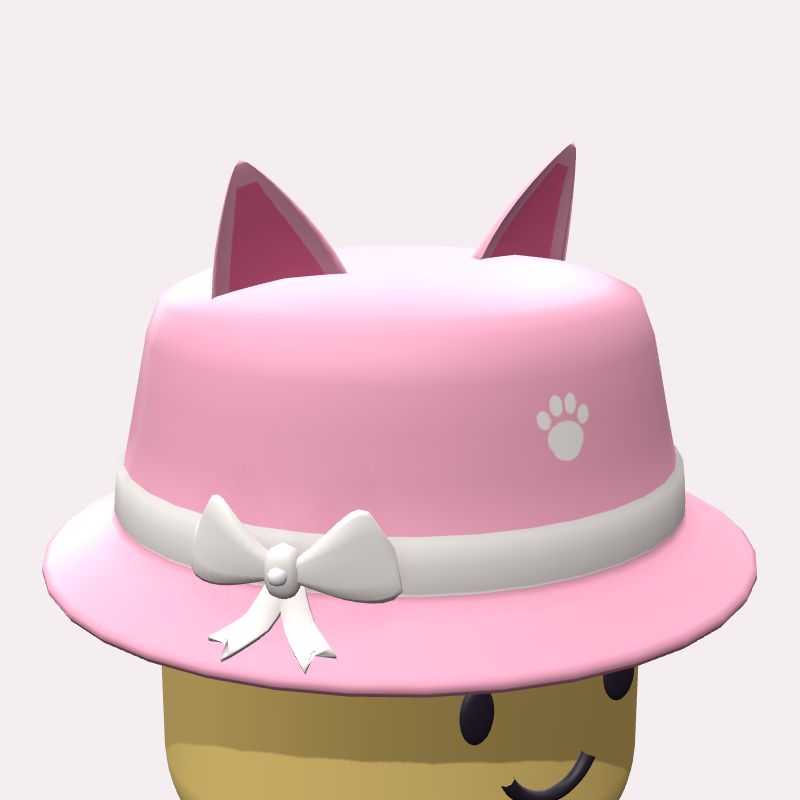
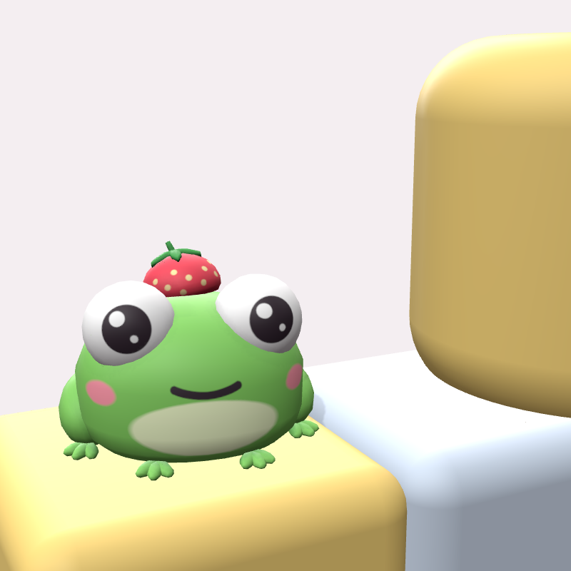

# 🛍️ Collection UGC Roblox « Kawaii »

Des accessoires Roblox prêts à importer dans Studio et à publier, dans un style **plastique simple** (aplats de couleur propres, sans fourrure ni bruit), avec **5 coloris** chacun. Chaque coloris est un fichier `.fbx` avec sa texture intégrée.

Ces objets suivent des tendances : les cheveux sont la catégorie qui se vend le plus, les accessoires de visage se vendent le plus vite, et les ailes, le dos, les oreilles d'animaux, les nœuds « coquette » et le pastel progressent. Proposer plusieurs coloris aide aussi les ventes.

<!-- collection:start -->
| | Objet | Type | Coloris | Triangles |
|---|---|---|---|---|
|  | **[Bob Oreilles de Chat Kawaii + Nœud](ugc/neko-bucket-hat/LISEZMOI.md)**<br>Kawaii Cat Ear Bucket Hat w/ Bow | Hat (chapeau) | Fraise, Matcha, Minuit, Nuage, Choco | 3820 |
|  | **[Grenouille d'épaule au chapeau fraise](ugc/froggy-shoulder-pal/LISEZMOI.md)**<br>Froggy Shoulder Pal w/ Strawberry Hat | Shoulder (épaule) | Vert, Rose, Bleu, Citron, Choco | 3914 |
<!-- collection:end -->

Clique sur le nom d'un objet pour ouvrir sa notice (`LISEZMOI.md`). Elle donne les fichiers, les réglages exacts de Studio, le placement attendu sur le mannequin, la fiche Marketplace et le tableau de conformité.

---

## 🚀 De Studio à la Marketplace (valable pour tous les objets)

1. **Importer** : dans Roblox Studio, ouvre **Import 3D** (menu *File* ou onglet *Home*) et choisis le `.fbx` de la couleur voulue (`ugc/<objet>/fbx/`). **Ne change aucun réglage** : *Scale Unit* = Studs, *World Forward* = Front, *World Up* = Top, *Upload to Roblox* coché. Clique sur **Import**. L'objet apparaît déjà texturé.
2. **Transformer en accessoire** : ouvre l'onglet **Avatar › Accessory** (Accessory Fitting Tool). Sélectionne le MeshPart importé, puis choisis **Accessory ›** le type indiqué dans la notice (Hat, Hair, Face, Back, Shoulder…) et le *body type* **Classic**. Place l'objet comme sur l'aperçu, puis clique sur **Generate MeshPart Accessory**.
3. **Vérifier** : sélectionne l'`Accessory`, ouvre **View › Command Bar** et colle tout [`ugc/VerifierUGC.lua`](ugc/VerifierUGC.lua). Il reconnaît le type d'accessoire, corrige ce que Roblox impose (matériau Plastic, transparence 0) et contrôle la taille. Il doit afficher **🎉 Prêt**.
4. **Uploader** : fais un clic droit sur l'`Accessory` › **Save to Roblox** › *Avatar Asset* › le type d'accessoire. Remplis le titre et la description (fiche Marketplace de la notice), puis clique sur **Submit**.
5. **Modération**, puis **mise en vente** dans le [Creator Hub › Creations](https://create.roblox.com/dashboard/creations) (prix, Limited ou non, **Publish**).

> ⚠️ **Prérequis compte** : pour vendre sur la Marketplace, ton compte doit remplir les [conditions créateur de Roblox](https://create.roblox.com/docs/marketplace/marketplace-policy#creator-and-group-requirements), et des [frais d'upload et de publication](https://create.roblox.com/docs/marketplace/marketplace-fees-and-commissions) s'appliquent. Si le menu *Asset type* n'apparaît pas à l'étape 4, ton compte n'y a pas encore accès.

---

## ✅ Ce qui est vérifié pour chaque objet

`tools/validate_ugc.py` contrôle chaque objet selon les [spécifications des accessoires rigides Roblox](https://create.roblox.com/docs/avatar/rigid-accessories/specifications). Chaque FBX est aussi réimporté dans Blender pour s'assurer qu'il est identique au modèle :

- ≤ 4 000 triangles, un seul maillage et un seul matériau, uniquement des triangles et des quads ;
- volumes fermés (étanches), normales vers l'extérieur, aucune face dégénérée ;
- UV dans 0–1, sans chevauchement entre les pièces ;
- taille dans la boîte autorisée pour le type d'accessoire (Classic et Normal, et Slender quand c'est possible) ;
- une texture PNG de 1024 × 1024 par coloris, intégrée dans un FBX binaire.

Les FBX sont exportés avec Blender 5.2 selon les réglages de la doc Roblox (*Path Mode = Copy*, *Embed Textures*, *Apply Scalings = FBX Unit Scale*, avant = Z, haut = Y) : 1 unité = 1 stud, et l'avant de l'objet regarde l'avant de l'avatar.

Ce qui reste invérifiable d'ici : je n'ai pas Roblox Studio, donc l'import réel et la validation finale de Roblox au moment de l'upload n'ont pas été testés.

---

## 🛠️ Dépannage

- **La texture n'apparaît pas après l'import** : importe le PNG `textures/<Nom>_<Couleur>_Albedo.png` de l'objet dans l'**Asset Manager**, puis colle son ID dans `Handle › TextureID`.
- **L'objet arrive au mauvais endroit dans l'Accessory Fitting Tool** : chaque notice donne le placement attendu et le décalage exact à appliquer si l'outil le centre sur le point d'attache.
- **L'objet regarde vers l'arrière** : tourne-le de 180° autour de l'axe vertical dans l'Accessory Fitting Tool avant *Generate*. En principe ça n'arrive pas.
- **Trop grand ou trop petit sur ton avatar** : ajuste l'échelle dans l'Accessory Fitting Tool. `VerifierUGC.lua` te dit si tu dépasses la boîte autorisée.
- **Plan B** : `obj/<Nom>.obj` contient le même maillage. Importe-le, puis applique la texture comme ci-dessus.

---

## 🔁 Modifier ou créer un objet

Tout est procédural. Chaque objet est un module Python dans `tools/items/` : formes (`build_shells`), couleurs (`COLORWAYS`), zones de couleur (`paint`) et fiche (`LISTING`). Le contrat est décrit dans [`tools/items/README.md`](tools/items/README.md).

```bash
pip install -r tools/requirements.txt
python3 -m pip install bpy                           # Blender en module Python (≈ 400 Mo), pour les FBX
(cd tools/render && npm install)                     # pour les aperçus

python3 tools/build_ugc.py neko_bucket_hat           # maillage .obj + textures
python3 tools/blender_export.py neko-bucket-hat      # FBX prêts pour Studio + contrôle aller-retour
python3 tools/validate_ugc.py --all                  # règles UGC Roblox
python3 tools/render_previews.py neko-bucket-hat     # aperçus
python3 tools/write_guides.py                        # notices LISEZMOI.md + tableau ci-dessus
```
