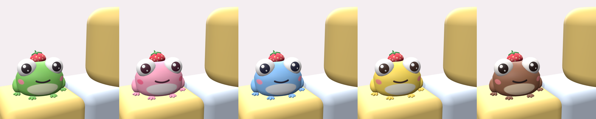

# Grenouille d'épaule au chapeau fraise : UGC Roblox (Shoulder)

Une petite grenouille toute ronde qui s'installe sur ton épaule droite. Grands yeux brillants, sourire tout doux, joues roses, petites pattes et un mini chapeau fraise sur la tête. Existe en 5 coloris : Vert, Rose, Bleu, Citron et Choco !



## Fichiers

| Coloris | À importer dans Studio | Texture seule (dépannage) |
|---|---|---|
| Vert | [`fbx/FroggyShoulderPal_Vert.fbx`](fbx/FroggyShoulderPal_Vert.fbx) | `textures/FroggyShoulderPal_Vert_Albedo.png` |
| Fraise | [`fbx/FroggyShoulderPal_Fraise.fbx`](fbx/FroggyShoulderPal_Fraise.fbx) | `textures/FroggyShoulderPal_Fraise_Albedo.png` |
| Bleu | [`fbx/FroggyShoulderPal_Bleu.fbx`](fbx/FroggyShoulderPal_Bleu.fbx) | `textures/FroggyShoulderPal_Bleu_Albedo.png` |
| Citron | [`fbx/FroggyShoulderPal_Citron.fbx`](fbx/FroggyShoulderPal_Citron.fbx) | `textures/FroggyShoulderPal_Citron_Albedo.png` |
| Choco | [`fbx/FroggyShoulderPal_Choco.fbx`](fbx/FroggyShoulderPal_Choco.fbx) | `textures/FroggyShoulderPal_Choco_Albedo.png` |

Chaque `.fbx` contient le maillage **et** sa texture.

## Dans Roblox Studio

1. **Import 3D** : choisis un des `.fbx` ci-dessus et ne change aucun réglage (*Scale Unit* = Studs, *World Forward* = Front, *World Up* = Top). Taille affichée : environ **0,72 × 0,54 × 0,56** studs, **3 914 triangles**.
2. **Avatar › Accessory** (Accessory Fitting Tool) : *Part* = le MeshPart `FroggyShoulderPal`, *Asset Type* = **Accessory › Shoulder** (côté **droit**), *body type* = **Classic**.
3. **Placement** : La grenouille est assise sur le dessus du bras droit, à environ 0,45 stud du cou, les pattes posées sur l'épaule ; elle regarde vers l'avant, un peu tournée vers l'extérieur, et ne touche pas la tête.
   Si l'outil pose l'objet centré sur son point d'attache (`RightCollarAttachment`) : monte-le de **0,26 stud**, décale-le de **0,44 stud** vers la droite de l'avatar.
4. **Generate MeshPart Accessory**, puis sélectionne l'Accessory et colle [`VerifierUGC.lua`](../VerifierUGC.lua) dans la Command Bar : il doit afficher « 🎉 Prêt ».
5. Clic droit sur l'Accessory › **Save to Roblox** › *Avatar Asset* › **Shoulder**.

## Fiche Marketplace

| Coloris | Titre EN | Titre FR |
|---|---|---|
| Vert | `Froggy Shoulder Pal w/ Strawberry Hat - Green` | `Grenouille d'épaule au chapeau fraise - Vert` |
| Fraise | `Froggy Shoulder Pal w/ Strawberry Hat - Pink` | `Grenouille d'épaule au chapeau fraise - Rose` |
| Bleu | `Froggy Shoulder Pal w/ Strawberry Hat - Blue` | `Grenouille d'épaule au chapeau fraise - Bleu` |
| Citron | `Froggy Shoulder Pal w/ Strawberry Hat - Lemon` | `Grenouille d'épaule au chapeau fraise - Citron` |
| Choco | `Froggy Shoulder Pal w/ Strawberry Hat - Choco` | `Grenouille d'épaule au chapeau fraise - Choco` |

**Description (EN)**
```
A chubby little frog that sits on your right shoulder. Big sparkly eyes, a sweet smile, rosy cheeks, tiny feet and a mini strawberry hat. Available in 5 colors: Green, Pink, Blue, Lemon and Choco!
```
**Description (FR)**
```
Une petite grenouille toute ronde qui s'installe sur ton épaule droite. Grands yeux brillants, sourire tout doux, joues roses, petites pattes et un mini chapeau fraise sur la tête. Existe en 5 coloris : Vert, Rose, Bleu, Citron et Choco !
```

## Conformité (mesurée par `tools/validate_ugc.py`)

| Règle Roblox | Limite | Cet objet |
|---|---|---|
| Triangles | ≤ 4 000 | **3914** |
| Maillage / matériau | 1 / 1 | ✅ |
| Volumes fermés, normales vers l'extérieur | tous | ✅ 20 pièces |
| Boîte Shoulder Classic | 3,00 × 3,00 × 3,00 | ✅ 0,72 × 0,54 × 0,56 |
| Boîte Shoulder Normal | 2,95 × 3,68 × 3,24 | ✅ 0,72 × 0,54 × 0,56 |
| Boîte Shoulder Slender | 2,59 × 3,39 × 2,88 | ✅ 0,72 × 0,54 × 0,56 |
| Texture | ≤ 1024 px | ✅ 1024 × 1024 PNG |
